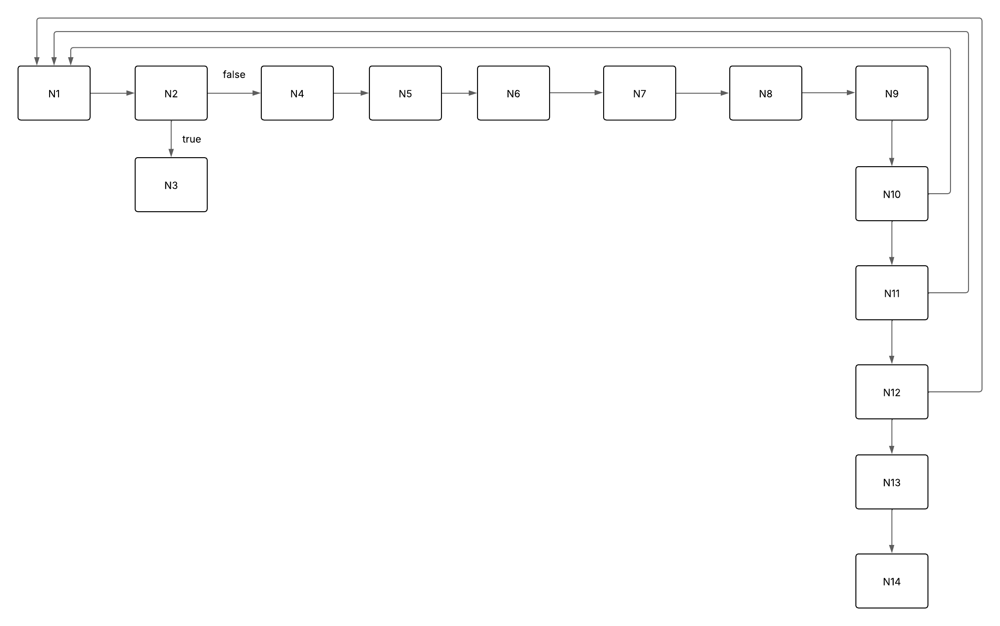

# Algoritmo de Karatsuba

## O que é este projeto?
Este projeto apresenta uma implementação em python do algoritmo de Karatsuba, bem como a análise de complexidade assintótica e ciclomática deste algoritmo.

## O que é o Algoritmo de Karatsuba?
O algoritmo de Karatsuba é um método para realizar multiplicações de números grandes de uma maneira mais eficiente do que a tradicional, que aprendemos na escola.
Esse trabalha utilizando a ideia de dividir para conquistar, pois apresenta uma implementação recursiva, dividindo os números ao meio a cada nova chamada. Com isso, ele reduz o número de multiplicações necessárias, o que é muito útil para números com muitos dígitos.

## Como rodar o projeto
Para rodar o projeto, é preciso ter o Python 3 instalado e uma IDE. A partir disso, execute no terminal o seguinte comando:
```bash
   python main.py
```
## Lógica da implementação

```python
def karatsuba(x, y):
```
A função começa recebendo como parâmetros os números a serem multiplicados, representados pelas variáveis x e y.


```python
 if x < 10 or y < 10:
        return x * y
```
Posteriormente, o algoritmo verifica a condicional que representa o caso base da recursão. Se os números tiverem apenas um dígito, é realizada a multiplicação entre eles e o resultado é retornado. Esse é o caso base porque com apenas um dígito, não é possível dividir os números.


```python
n = max(len(str(x)), len(str(y)))
```
Caso a condicional for falsa, o algoritmo continua a sua execução para a definição da variável n, que representa o número de dígitos do maior número. Ela é usada para decidir onde dividir os números ao meio.


```python
meio = n // 2
```
Em seguida, o algoritmo se encaminha para a definição da variável meio, que representa o índice do meio do número, servindo para separar os números em partes mais significativas (as partes maiores) e as partes menos significativas (as partes menores).


```python
x_maior = x // (10 ** meio)         
x_menor = x % (10 ** meio)

y_maior = y // (10 ** meio)
y_menor = y % (10 ** meio)
```
Em seguida, os números x e y são divididos em partes mais significativas e menos significativas.


```python
  a = karatsuba(x_maior, y_maior)
  c = karatsuba(x_maior + x_menor, y_maior + y_menor)
  b = karatsuba(x_menor, y_menor)
```
Posteriormente, são realizadas as chamadas recursivas. A chamada recusriva retornada para a variável a realiza o produto das partes mais significativas, enquanto a chamada recusiva que retorna para a variável b realiza o produto das menos significativas. Já a da variável c é usada para calcular a multiplicação da soma das partes.


```python
  d = c - a - b
```
A variável d recebe o valor do termo do meio do algoritmo de Karatsuba. 


```python
return a * (10**(2*meio)) + d * (10**meio) + b
```
E, por fim, é retornado o resultado final da multiplicação de x e y, realizando deslocamentos de dígitos e multiplicação de 3 termos.

## Complexidade ciclomática

Grafo criado:



**Nós:**
1. N1 - início da função
2. N2 - verificação da condicional
3. N3 - retorno de x * y
4. N4 - inicialização de n
5. N5 - inicialização de meio
6. N6 - definição de x_maior
7. N7 - definição de x_menor
8. N8 - definição de y_maior
9. N9 - definição de y_menor
10. N10 - primeira chamada recursiva
11. N11 - segunda chamada recursiva
12. N12 - terceira chamada recursiva
13. N13 - atribuição do valor de d
14. N14 - retorno final

**Arestas:**
1. N1 -> N2: Do início da função para a verificação da condicional
2. N2 -> N3: Caso a condição seja verdadeira, do condicional vai para o retorno de x*y
3. N2 -> N4: Caso a condição seja falsa, vai do condicional para a inicialização de n
4. N4 -> N5: Da inicialização de n para a inicialização de meio
5. N5 -> N6: Da inicialização de meio mara a definição de x_maior
6. N6 -> N7: Da definição de x_maior para a definição de x_menor
7. N7 -> N8: Da definição de x_menor para a definição de y_maior
8. N8 -> N9: Da definição de y_maior para a definição de y_menor
9. N9 -> N10: Da definicão de y menor para a primeira chamada recursiva
10. N10 -> N1: Da primeira função recursiva para o início da função (quando ela chama a si própria)
11. N10 -> N11: Da primeira chamada recursiva para a segunda chamada recursiva
12. N11 -> N1: Da segunda função recursiva para o início da função
13. N11 -> N12: Da segunda função recursiva para a terceira função recursiva
14. N12 -> N1: Da terceira função recursiva para o início da função
15. N12 -> N13: Da terceira função recursiva para a atribuição do valor de d
16. N13 -> N14: Da atriuição do valor de d para o retorno final

**Complexidade ciclomática:** 

M = E - N + 2P

M = 16 - 14 + 2*1

M = 4

## Complexidade Assintótica
**Melhor Caso:** O(1), quando um dos números tem apenas um dígito.

**Caso Médio:** O(n^log3), o que é aproximadamente O(n^log1.585).

**Pior Caso:** O(n^log3), o que é aproximadamente O(n^log1.585).

